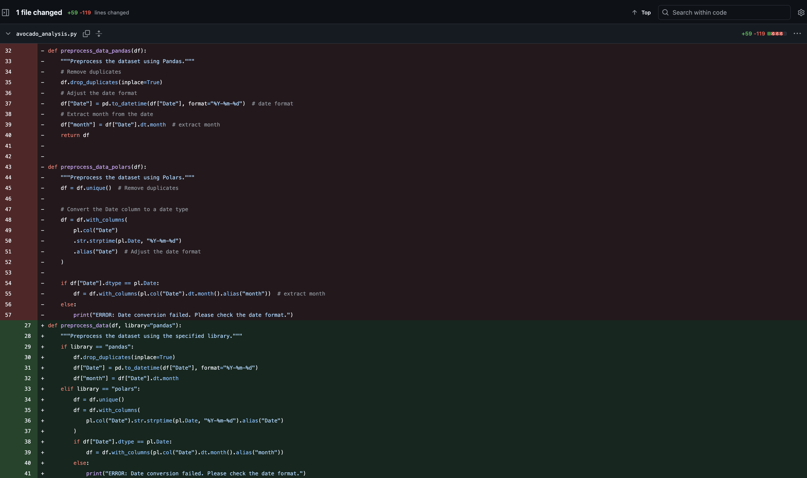

[](https://github.com/ammylin/avocado-price-analysis/actions/workflows/main.yml)


# IDS 706: Avocado Price Analysis (Weeks 2-5)

## Project Description
The provided code is a comprehensive analysis of avocado prices in Chicago, utilizing both Pandas and Polars libraries for data manipulation and analysis. The goal is to determine how average avocado prices vary by month in the year 2015. The analysis employs linear regression to model the relationship between the month and the average price of avocados. 

### Project Structure 
```bash
avocado-price-analysis/
├── .github/workflows/       # CI/CD configuration
├── .devcontainer/           # Development environment setup
├── data/                    # Data files and datasets
├── img/                     # Visualizations and screenshots
├── avocado_analysis.py      # Main analysis pipeline
├── test_avocado_analysis.py # Test suite
├── requirements.txt         # Project dependencies
├── Dockerfile               # Docker container configuration
├── Makefile                 # Build automation
└── README.md                # Project documentation
```
### Setup Instructions 
To set up this repository, I followed the steps outlined in Week 1's Python template here: `https://github.com/ammylin/IDS_706_python_temp`. Additionally, I loaded the CSV file from Kaggle in order to perform analysis on it. I also installed the required libraries, which I outline below, as well as my instructions for setting up Dev containers and Docker: 

#### Download the Dataset
1. Go to the Kaggle dataset page: [Avocado Prices Dataset](https://www.kaggle.com/datasets/neuromusic/avocado-prices/data).
2. Click on the "Download" button to download the dataset.
3. Move the downloaded CSV file (`avocado.csv`) to the project directory where the code is located.

#### Required Libraries
- Pandas (used for data analysis)
- Polars (used for data analysis)
- Matplotlib (used to make visualizations)
- scikit-learn (used for the machine learning algorithm, in which I used LinearRegression)

#### Installation
To install the required libraries, you can use pip. Run the following command in your terminal:

```
pip install pandas polars matplotlib scikit-learn
```

#### Creating a Dev Container and Configuring Docker
After downloading the Dev Containers extension from VSCode and installing the Docker desktop application, I created my Dev container in VSCode using the following steps: 
1. Press `Cmd + Shift + P`, then click on "Dev Containers: Add Dev Container Configuration Files". 
2. Select the configuration of choice (for this, I selected the Python 3 configuration). 
3. In the next menu, add more features as needed. 
4. Open the Dev container by clicking on the blue button on the bottom left corner of VSCode. 

At this point, we can open up the Docker desktop app and see, under "Containers", the details of our configuration. Now, to build an image from the Dockerfile and run the Docker container, I created a Dockerfile and related setups by: 
1. Press `Cmd + Shift + P`, then click on "Docker: Add Docker Files to Workspace." 
1. Press `Cmd + Shift + P`, then click on "Containers: Add Docker Files to Workspace." 
2. In the terminal, I ran: `docker build -t container-name .` (For me, "container-name" was `naughty-agnesi`). This builds an image from the Dockerfile. 
3. Next, I ran `docker run -d -p 8088:3000 --name my-avocado-container welcome-to-docker`. This runs the container in the background (-d), maps port 8088 on my host to port 3000 inside the container, and names the container my-avocado-container.
4. On Docker desktop app, under "Ports," I clicked `8088:3000`, which opened the following on my browser: 

This is what my Docker desktop app displayed under the "Containers" tab: 


Setting up Dev containers with Docker helps us address the "it works on my machine" problem; that is, by containerizing our development environment, we ensure consistent setups across different machines and team members. This makes onboarding smoother, eliminates environment mismatches, and streamlines deployment, since the container encapsulates all dependencies and configurations in a portable way.

### Makefile Automation

To simplify the development process, a Makefile is included in this project. It automates common tasks such as installing dependencies, formatting code, linting, running tests, and cleaning up files. Below are the available commands:

- `make install`: used to install the necessary dependencies or set up the project environment. This installs packages listed in `requirements.txt`, including tools like `pylint`, `flake8`, `pytest`, `click`, `black`, and `pytest-cov`.
- `make format`: formats the code according to preferred style guidelines. We format using black.
- `make lint`: runs a linting tool, which analyzes the code for potential errors, stylistic issues, and bugs. We use flake8 as our linting tool.
- `make test`: runs the project's test suite using pytest, which allows us to write and execute tests to verify that the code behaves as expected.
- `make clean`: used to remove any generated files or artifacts from the build process to ensure that the next build does not have any leftovers from previous builds. 

Using a Makefile automation allows us to streamline our Continuous Integration and Continuous Deployment (CI/CD) processes. I use GitHub Actions to automatically run tests whenever changes are pushed to the repository. The image below shows examples of successful CI workflows after changes were made: 


### Code Refactoring 
Refactoring is the process of restructuring existing computer code without changing its external behavior. The primary goal of refactoring is to improve the code's readability, reduce complexity, and enhance maintainability while preserving its functionality. This practice helps developers create cleaner, more efficient code that is easier to understand and modify in the future.

For this project, I undertook a significant refactoring process to enhance the code's readability, maintainability, and efficiency. The key changes made during this process include: 

- **Consolidation of Functions**: I consolidated duplicate functions into a single set of functions that utilize a library parameter to switch between Pandas and Polars. This eliminates the need for separate functions like `load_data_pandas` and `load_data_polars`, for example, streamlining the codebase. 


- **Creation of Helper Functions**: I developed helper functions such as `load_data()`, `preprocess_data()`, `filter_chicago_data()`, and `compute_monthly_average_price()`. These functions handle both libraries based on the provided parameter, reducing redundancy and improving code organization.

- **Centralized Logic**: The core analysis logic has been centralized into a single `run_analysis()` function that works seamlessly with either Pandas or Polars. This approach simplifies the execution flow and enhances modularity.

- **Reduction of Duplicated Code**: By using conditionals within the functions, I removed duplicated code, making the codebase cleaner and easier to maintain.

- **Descriptive Naming**: Variables and functions have been renamed to be more descriptive, improving code readability and making it easier for others to understand the purpose of each component. For example, the function `preprocess_data_pandas` was refactored to a more general `preprocess_data(library)` function, which takes a parameter to specify whether to use Pandas or Polars, thus enhancing clarity and flexibility. 


- **Debugging and Error Handling**: I implemented print debugging and error handling to ensure that the code runs smoothly and provides informative feedback during execution.

#### Refactoring Goals Achieved

The refactoring process aimed to reduce duplication, improve readability, and increase maintainability. I successfully:

- Extracted repeated code (such as loading, preprocessing, and filtering) into single parameterized functions, aligning with best practices for code reuse.
- Renamed functions and variables consistently and descriptively, enhancing clarity.
- Created a much cleaner code structure with less duplication and better modularity by replacing duplicated pairs of functions (for Pandas and Polars) with a unified approach.

Overall, the refactoring has resulted in a more efficient and maintainable codebase, making it easier to extend and modify in the future.


## Key Components of the Code
### Data Loading and Exploration
The code includes functions to load the avocado dataset using both Pandas and Polars. I inspected the data during my exploratory data analysis (EDA) using functions like `.head()`, `.info`, etc., which I did not include in my file. 

### Data Preprocessing
Data preprocessing is crucial for preparing the dataset for analysis. The code includes separate functions for both libraries to:
- Remove duplicates.
- Convert the "Date" column to a datetime format.
- Extract the month from the date.

### Data Filtering
The analysis focuses specifically on avocados sold in Chicago. Functions like `.groupby`/`.group_by` and `.filter` are utilized to filter the dataset accordingly.

### Monthly Average Price Calculation
The average price of avocados is computed by month using both libraries, allowing for a direct comparison of performance.

### Model Training and Evaluation
A linear regression model is trained using the monthly average prices, and its performance is evaluated using metrics such as Mean Absolute Error (MAE) and R-squared (R²).

### Visualization
The results are visualized using Matplotlib, showing the actual vs. predicted prices, which helps in understanding the model's performance.

### Test File 
I created a test file, `test_avocado_analysis.py`, that test whether `avocado_analysis.py` properly loads, preprocesses, filters, and runs the ML algorithm and analysis correctly. 
To ensure the code functions correctly, run the test file `test_avocado_analysis.py`. This file tests the following:
- Data loading and preprocessing.
- Filtering for Chicago data.
- Monthly average price calculations.
- Model training and evaluation.

## Outcomes 
### Pandas Analysis


Using Pandas, I got the following metrics:
- Mean Absolute Error (MAE): `0.12` (This indicates the average difference between predicted and actual prices.)
- R-squared: `0.15` (This means that 15% of the variability in avocado prices is explained by the model.)

### Polars Analysis


Using Polars, I got the following metrics:
- Mean Absolute Error (MAE): `0.02`
- R-squared: `0.97`

### Summary
All in all, it appears that Polars provides a better regression model for the relationship between the month and the average price of avocados. We can see this because the Mean Absolute Error (MAE) using Polars is `0.02`, which means that the predicted average price of avocados is off by $0.02 from the actual prices, while it is `0.12` for the Pandas analysis. Likewise, the R-squared value for the Polars analysis is `0.97`, which means that 97% of the variability in avocado prices can be explained by the model. This indicates a strong fit, suggesting that the month is a significant predictor of avocado prices in Chicago.

In contrast, the Pandas analysis, with an R-squared value of `0.15`, shows that only 15% of the variability in avocado prices is accounted for by the model, indicating a much weaker relationship. This stark difference in performance highlights the effectiveness of Polars in handling this regression task, likely due to its optimized performance and efficient data handling capabilities.

Overall, the results suggest that for this type of analysis, using Polars may yield more accurate and reliable predictions compared to Pandas. It is possible that Polars handles internal data types or indexing differently, resulting in better model inputs. Regardless of the cause, the results demonstrate that tool selection can meaningfully impact model performance, even when using the same underlying data and algorithm.

Moreover, recognizing the limitations of this analysis, I note that the model is based on a single year of data (2015), which restricts its generalizability. Incorporating data from multiple years or additional features—such as region, avocado type, or seasonal events—could improve predictive power and produce more actionable insights.

## Data Source & Acknowledgments 
This dataset was retrieved from a public dataset on Kaggle linked here: `https://www.kaggle.com/datasets/neuromusic/avocado-prices/data`. These data were originally downloaded from the Hass Avocado Board website (`http://www.hassavocadoboard.com/retail/volume-and-price-data`) in May of 2018 and compiled into a single CSV. 

I used the Python template from Week 1 of this class, which referred to Professor Yu's template and instructions. Additionally, some of the code for this project was generated using the assistance of generative AI (specifically, OpenAI's GPT-4o and GitHub Copilot). 